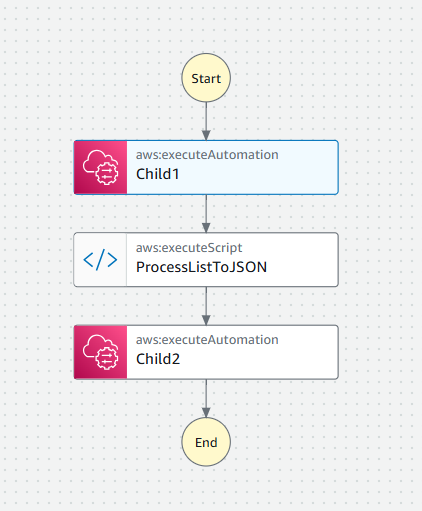

# ssm-automation-outputs

Recently, I had a problem how to parse multiple outputs from one child SSM Automation to another child SSM Automation.

Child1 automation is providing two outputs which I would like to use as inputs in Child2 automation.

This issue was resolved with assistance from Charles, an AWS Systems Manager SME from AWS Support.

As he told me, output from `aws:executeAutomation` action is in `StringList` format, which is essentially a list of strings. This format cannot be processed with standard Selector syntax because Selector syntax is designed to work with JSONPath formatted outputs, which are structured JSON objects or arrays. To bridge this gap, an intermediary step is required to extract the content of the `StringList` output and convert it into a JSON format that can be processed further.

An intermediary step is required to extract content of StringList output and convert to JSON.

The main automation executes Child1, parses its output (ProcessListToJSON step), and then executes Child2 with the parsed inputs.

In this repo you will find example of such solution.

Reference:
- https://docs.aws.amazon.com/systems-manager/latest/userguide/automation-action-executeAutomation.html

## Requirements

| Name | Version |
|------|---------|
|  [terraform](#requirement\_terraform) | >= 1.5.7 |
|  [aws](#requirement\_aws) | ~> 5.0 |

## Providers

| Name | Version |
|------|---------|
|  [aws](#provider\_aws) | 5.98.0 |

## Modules

No modules.

## Resources

| Name | Type |
|------|------|
| [aws_iam_policy.pass_role_policy](https://registry.terraform.io/providers/hashicorp/aws/latest/docs/resources/iam_policy) | resource |
| [aws_iam_role.ssm_automation_role](https://registry.terraform.io/providers/hashicorp/aws/latest/docs/resources/iam_role) | resource |
| [aws_iam_role_policy_attachment.ssm_automation_policy_attachment](https://registry.terraform.io/providers/hashicorp/aws/latest/docs/resources/iam_role_policy_attachment) | resource |
| [aws_iam_role_policy_attachment.ssm_pass_role_policy_attachment](https://registry.terraform.io/providers/hashicorp/aws/latest/docs/resources/iam_role_policy_attachment) | resource |
| [aws_ssm_document.child_1](https://registry.terraform.io/providers/hashicorp/aws/latest/docs/resources/ssm_document) | resource |
| [aws_ssm_document.child_2](https://registry.terraform.io/providers/hashicorp/aws/latest/docs/resources/ssm_document) | resource |
| [aws_ssm_document.main](https://registry.terraform.io/providers/hashicorp/aws/latest/docs/resources/ssm_document) | resource |

## Inputs

No inputs.

## Outputs

No outputs.
